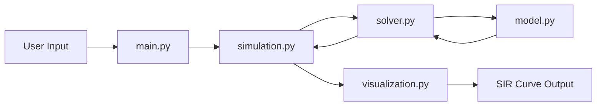

# 🦠 Ebola SIR Epidemic Simulator

## 1. Project Overview

This project implements a **Susceptible–Infected–Recovered (SIR)** epidemiological model to simulate the spread of **Ebola Virus Disease** in a closed population.

The model is formulated using **ordinary differential equations (ODEs)** and solved numerically using the **explicit Euler method**.  
The simulation is interactive, allowing the user to adjust key parameters such as population size, infection rate, recovery rate, and simulation duration.  
Results are visualized using **Matplotlib**.

The project was developed as part of an academic assignment to demonstrate:
- understanding of epidemiological modeling,
- application of numerical methods,
- clean and modular software architecture,
- reproducible and testable Python code.

---

## 2. Epidemiological Theory

### 2.1 Compartmental Modeling

Compartmental models are a fundamental tool in mathematical epidemiology.  
They divide a population into groups (compartments) based on disease status and describe transitions between these compartments over time.

For this project, the **SIR model** is used. It is suitable for Ebola because:
- transmission occurs through direct contact,
- infected individuals are infectious for a limited period,
- recovered individuals typically gain long-term immunity.

---

### 2.2 SIR Compartments

The population is divided into three compartments:

- **S(t)** – Susceptible individuals  
- **I(t)** – Infected individuals  
- **R(t)** – Recovered (or removed) individuals  

The total population is assumed to be constant:

\[
N = S(t) + I(t) + R(t)
\]

---

### 2.3 Governing Differential Equations

The dynamics of Ebola transmission are described by the following system of ordinary differential equations:

\[
\frac{dS}{dt} = -\beta \frac{S I}{N}
\]

\[
\frac{dI}{dt} = \beta \frac{S I}{N} - \gamma I
\]

\[
\frac{dR}{dt} = \gamma I
\]

Where:
- **β (beta)** is the infection rate  
- **γ (gamma)** is the recovery/removal rate  

---

### 2.4 Basic Reproduction Number

A key theoretical concept is the **basic reproduction number**:

\[
R_0 = \frac{\beta}{\gamma}
\]

- If \( R_0 > 1 \), an epidemic occurs  
- If \( R_0 < 1 \), the infection dies out  

For Ebola, parameter choices typically lead to \( R_0 > 1 \), explaining the rapid initial growth of infections.

---

## 3. Numerical Method

### 3.1 Why a Numerical Method Is Needed

The SIR differential equations generally do not have a simple closed-form analytical solution.  
Therefore, the system is solved numerically.

---

### 3.2 Euler Method

This project uses the **explicit Euler method**, which approximates the solution by stepping forward in small time increments.

For a variable \( X(t) \):

\[
X_{t+1} = X_t + \frac{dX}{dt} \cdot \Delta t
\]

In this project:
- the time step \( \Delta t \) is set to **1 day**
- the method is simple, transparent, and suitable for educational purposes

---

## 4. Software Architecture

The project follows a **modular architecture** with clear separation of concerns.


### 4.1 Design Rationale

- **model.py**  
  Contains only the mathematical formulation of the SIR model.

- **solver.py**  
  Implements the numerical method (Euler method).

- **simulation.py**  
  Controls the time evolution of the system.

- **visualization.py**  
  Responsible solely for plotting results.

- **main.py**  
  Acts as the single entry point for the user or examiner.

This design improves:
- readability,
- testability,
- maintainability,
- extensibility.

---

## 5. User Interaction

When running the program, the user is prompted to enter:

- total population size  
- initial number of infected individuals  
- infection rate (β)  
- recovery rate (γ)  
- number of simulation days  

This allows experimentation with different epidemic scenarios.

---

## 6. Visualization

The simulation produces a line plot showing:
- susceptible population over time,
- infected population over time,
- recovered population over time.

The plot clearly illustrates:
- the epidemic peak,
- the duration of the outbreak,
- the depletion of susceptible individuals.

---

## 7. Testing and Correctness

Unit tests are included to verify **population conservation**:

\[
S(t) + I(t) + R(t) = N
\]

This ensures that the numerical implementation of the model is mathematically consistent.

To run tests:

```bash
pytest


How to run the project 
1.install Dependencies 

pip install -r requirements.txt

2.Run the Simulation

python main.py
```
Example input:
```

Total population: 1000
Initial infected individuals: 10
Infection rate (beta): 0.47
Recovery rate (gamma): 0.09
Simulation days: 120

```
A plot of the epidemic dynamics will be displayed.

Testing

Unit tests verify population conservation, a core property of the SIR model:

𝑆
(
𝑡
)
+
𝐼
(
𝑡
)
+
𝑅
(
𝑡
)
=
𝑁
S(t)+I(t)+R(t)=N

---
Run tests with:
```

pytest
```
---
## 8. Limitations

- No explicit mortality modeling
- No incubation period (SEIR not included)
- Homogeneous mixing assumption
- Deterministic (no randomness)

These simplifications are intentional and appropriate for an educational model.
---
## 9. Use of Large Language Models (LLMs)

- Large Language Models were used as a support tool to:
- verify mathematical formulations,
- assist in code structuring,
- improve documentation clarity.
- All outputs were reviewed and validated to ensure correctness and understanding.

---
## Conclusion

This project demonstrates how epidemiological theory, numerical methods,
and modular software design can be combined to create a working and
interpretable disease spread simulator.

The SIR model provides clear insights into Ebola outbreak dynamics
while remaining simple and transparent.


---


